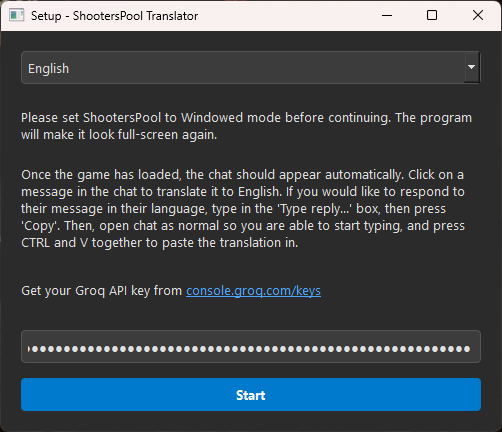
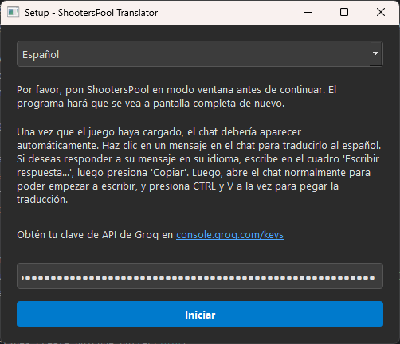
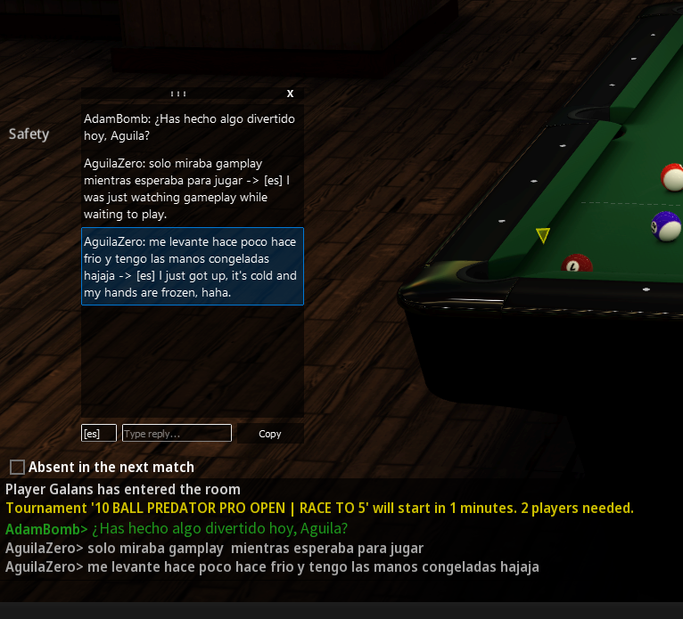

# ShootersPool Translator

A lightweight, always-on-top transparent overlay for ShootersPool Online that extracts in-game chat and provides real-time AI translation using the Groq API.

## Features
* Extracts chat logs directly from game memory without injecting DLLs.
* Provides on-demand AI translation to 11 different languages using the Groq API.
* Reverse-translates your typed replies into other players' native languages.
* Features a transparent, draggable, always-on-top UI that blends into the game.

## Setup Instructions

1. Download the latest `.exe` from the Releases tab.
2. Get your free API key from [console.groq.com/keys](https://console.groq.com/keys).
3. Open the Translator, select your preferred language, and paste your API key.

4. Open ShootersPool and ensure the game is set to **Windowed Mode** in the graphics settings.
5. Click **Start** in the Translator - it will automatically resize the game to act as a borderless full-screen window.
6. Click any chat message on the overlay to translate it, or use the bottom bar to type a reply and copy it to your clipboard.

## ⚠️ Important Antivirus Warning
This tool uses `pymem` to read the memory of the ShootersPool process to extract chat logs in real time. Because it accesses another program's memory - a technique commonly used by debuggers and game cheats - **Windows Defender and other antivirus software will likely flag the compiled `.exe` as a malicious file or virus**. 

This is a strict false positive. The source code is entirely open for you to verify, and you are welcome to run the program directly via Python instead of using the compiled executable.
